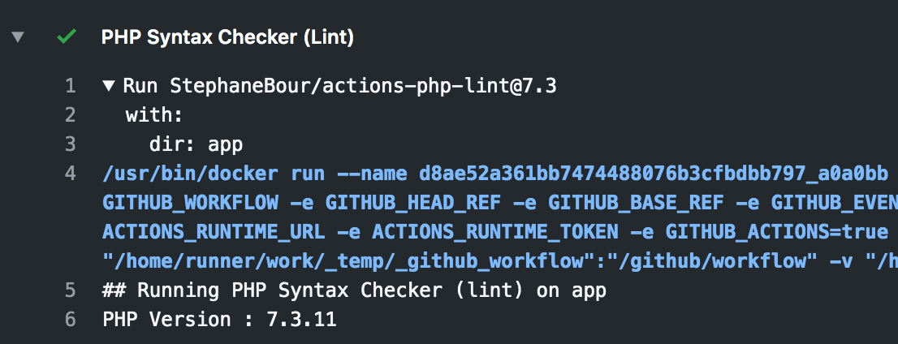
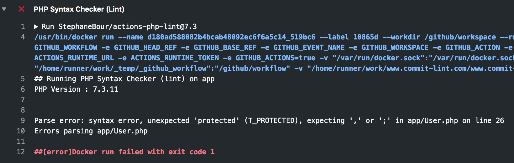

# PHP Syntax checker (lint) action

This action controls the syntax of php files in a folder, excluding the vendor folder.

## Inputs

### `dir`

The folder to control. Default `"."`.

## Example usage

```yaml
- name: PHP Syntax Checker (Lint)
  uses: stuudium/actions-php-lint@7.4
  with:
    dir: './src'
```

## Change PHP Version

You can use :
```
stuudium/actions-php-lint@7.4
stuudium/actions-php-lint@7.3
stuudium/actions-php-lint@7.2
stuudium/actions-php-lint@7.1
stuudium/actions-php-lint@7.0
stuudium/actions-php-lint@5.6
```

## On success



## On failure


